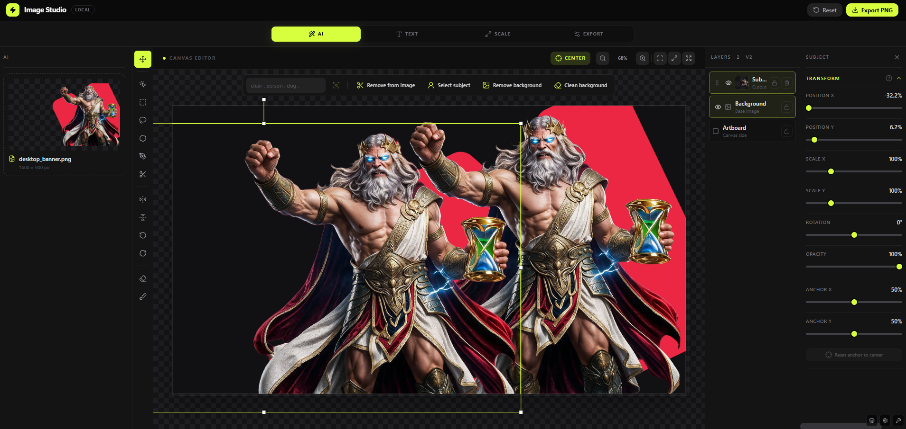

# Image Studio

Image Studio is a local-first, layered editor for turning still images into polished PNG compositions. It combines hands-on editing with local AI for object extraction, background removal, cleanup, and upscaling while keeping the original image intact.

> The app currently edits still images and exports PNG files; it is not a GIF timeline editor.



## What the app does

- Opens PNG, JPEG, and WebP images by file picker or drag and drop.
- Builds non-destructive compositions from background, cutout, overlay, enhanced, and text layers.
- Moves, scales, rotates, flips, crops, locks, hides, reorders, and changes the opacity of layers.
- Selects objects with a box, freehand lasso, polygonal lasso, brush, one-click point cut, or text prompt.
- Extracts objects as transparent, contour-cropped RGBA layers.
- Removes backgrounds with a soft alpha matte and supports brush-based mask refinement.
- Erases unwanted regions and reconstructs the missing background with local inpainting.
- Upscales the original source at 2x or 4x without replacing it.
- Adds styled text with local fonts, alignment, spacing, outline, color, opacity, and shadows.
- Saves and restores project compositions, including layer order and transforms.
- Exports the artboard or an enhanced layer as PNG, with optional lossless optimization.

## Workspaces

| Workspace | Purpose |
|---|---|
| **AI** | Select and extract objects, remove backgrounds, erase regions, clean behind a cutout, and refine masks. |
| **Text** | Add and style text layers, including fonts loaded from the local machine. |
| **Scale** | Create a separate Real-ESRGAN 2x or 4x enhanced layer and download it independently. |
| **Output** | Set artboard dimensions, transparency, background, palette reduction, and export the final PNG. |

The artboard, layer panel, inspector, undo/redo history, autosave, and project document are shared across all workspaces.

## Models and processing engines

Image Studio uses a fixed local model stack. It does not silently substitute another model when a required checkpoint is missing.

| Model or engine | Used for | Local file |
|---|---|---|
| **SAM 2.1 Hiera Large** | One-click point segmentation and precise masks inside detected boxes | `models/sam2/sam2.1_hiera_large.pt` |
| **Grounding DINO Swin-B** with local BERT | Finding the object described by a text prompt | `models/groundingdino/` |
| **BiRefNet General** (ONNX) | Soft background mattes and edge refinement around a SAM mask | `models/matte/birefnet-general.onnx` |
| **big-LaMa Full Places** | Filling regions removed with erase and clean-background tools | `models/lama/big-lama.pt` |
| **Real-ESRGAN x2plus** | 2x image upscaling | `models/realesrgan/RealESRGAN_x2plus.pth` |
| **Real-ESRGAN x4plus** | 4x image upscaling | `models/realesrgan/RealESRGAN_x4plus.pth` |
| **OpenCV GrabCut** | Non-neural box-based foreground extraction | Installed with the local API |
| **Pillow / oxipng** | PNG encoding, palette reduction, and optional lossless optimization | Installed locally; `oxipng` is optional |

The default compute policy is NVIDIA CUDA when usable, then CPU/system RAM. BiRefNet uses ONNX Runtime in `CUDAExecutionProvider` to `CPUExecutionProvider` order. CPU inference works but can be much slower. Force a device with `IMAGE_STUDIO_TORCH_DEVICE=cpu`, `cuda`, `cuda:0`, or `mps` (MPS is opt-in).

See [models/README.md](models/README.md) for checkpoint details and manual installation.

## How image processing works

Source pixels are kept separate from the editable project document. Browser image handles live in a runtime asset registry; the saved document contains serializable layers, transforms, masks, and output settings.

### Selection and extraction

- **Manual tools:** box and lasso tools define image-space regions; the mask brush adds to or erases from an extracted layer.
- **Point cut:** a canvas click is sent to SAM 2.1 Large. Disconnected mask islands are removed, the component under the click is kept, and the result becomes a tightly cropped transparent PNG layer.
- **Prompt selection:** Grounding DINO finds boxes from text, the best box goes to SAM 2.1 Large, and BiRefNet is blended near the boundary when its matte overlaps the selected object. The final mask becomes a contour-cropped RGBA layer.
- **Smart box extraction:** OpenCV GrabCut separates foreground inside a drawn rectangle without loading the neural selection stack.

### Background removal and cleanup

- BiRefNet produces a soft grayscale alpha matte for fine edges such as hair.
- Mask painting edits alpha instead of destroying the source.
- For erase and clean-background operations, white mask pixels mark the hole and big-LaMa reconstructs that region.
- Extraction and background filling are separate operations, so derived layers remain removable and the source can be recovered.

### Upscaling and PNG output

- Real-ESRGAN processes the selected layer's original bitmap, not an already composited preview.
- The 2x or 4x result is added as a separate enhanced layer.
- Preview and export use the same scene evaluation and layer ordering.
- The browser encodes the final PNG. The local API can add Pillow compression, optional 256-color palette reduction, and `oxipng -o 4` when available.

### Upload safeguards

The local API accepts PNG, JPEG, and WebP files up to 20 MB and 5000 x 5000 pixels. It verifies the extension, file signature, decoded format, dimensions, and image content. AI work also uses bounded concurrency, rate limits, queue limits, and memory guards.

## Quick start

Requirements:

- Node.js 20 or newer
- Python 3.11 or newer
- Git for the full AI setup
- Enough disk space and memory for the local checkpoints

Install the frontend, Python API, AI dependencies, and model weights:

```bash
npm run setup
npm start
```

Open [http://127.0.0.1:5173/studio/ai](http://127.0.0.1:5173/studio/ai).

Setup creates `.venv`, installs Node and Python dependencies, downloads checkpoints into `models/`, and creates `.env` from `.env.example` when needed. Runtime inference reads local weights and does not download them.

For the editor and lightweight image API without heavy AI packages:

```bash
npm run setup -- --minimal
npm start
```

Run `npm run setup` later to add the full AI stack. Missing capabilities are reported by `/api/health` and disabled in the interface.

## Common commands

| Command | Purpose |
|---|---|
| `npm run dev` | Start only the Vite editor |
| `npm run api` | Start only the local FastAPI service |
| `npm start` | Start the editor and API together |
| `npm run build` | Build the production web bundle |
| `npm test` | Run the JavaScript tests |
| `pytest -q` | Run Python tests from an activated virtual environment |
| `npm run check:openapi` | Verify the committed API contract |

## Local API

| Route | Operation |
|---|---|
| `POST /api/segment` | Smart box segmentation and optional background fill |
| `POST /api/ai/point-cut` | SAM point selection and RGBA cutout |
| `POST /api/ai/detect` | Prompt detection, segmentation, matte refinement, and cutout |
| `POST /api/ai/matte` | BiRefNet soft alpha matte |
| `POST /api/ai/inpaint` | big-LaMa masked fill |
| `POST /api/ai/upscale` | Real-ESRGAN 2x or 4x upscale |
| `POST /api/optimize-png` | PNG compression and optional palette reduction |

The API also provides health discovery, optional project persistence, and background-job status and cancellation. Its contract is in [schemas/api/openapi.json](schemas/api/openapi.json).

## Project structure

```text
src/
|-- ai/                 frontend AI clients and catalogs
|-- components/         shared interface components
|-- context/            editor orchestration and tools
|-- domain/             project and layer rules
|-- engine/             Konva canvas and filters
|-- image_studio/       Python API and local model runners
|-- layout/             studio shell and panels
|-- pages/              AI, Text, Scale, and Output workspaces
|-- render/             scene evaluation and render planning
|-- runtime/            bitmap and asset registries
`-- store/              editor state and project bridge
```

The project schema is in [schemas/project-v2.schema.json](schemas/project-v2.schema.json). Product and engineering details are in [BUILD_SPEC.md](BUILD_SPEC.md).

## Privacy

Images are processed in the browser and by the local FastAPI service. Model discovery prefers the repository's `models/` directory, and remote model access is opt-in through `.env`. Do not commit model weights, user images, `.env`, local databases, or generated output.

## Validation

```bash
npm test
npm run check:openapi
npm run build
```

```powershell
# Windows
.venv\Scripts\python.exe -m pytest
```

```bash
# macOS/Linux
.venv/bin/python -m pytest
```
